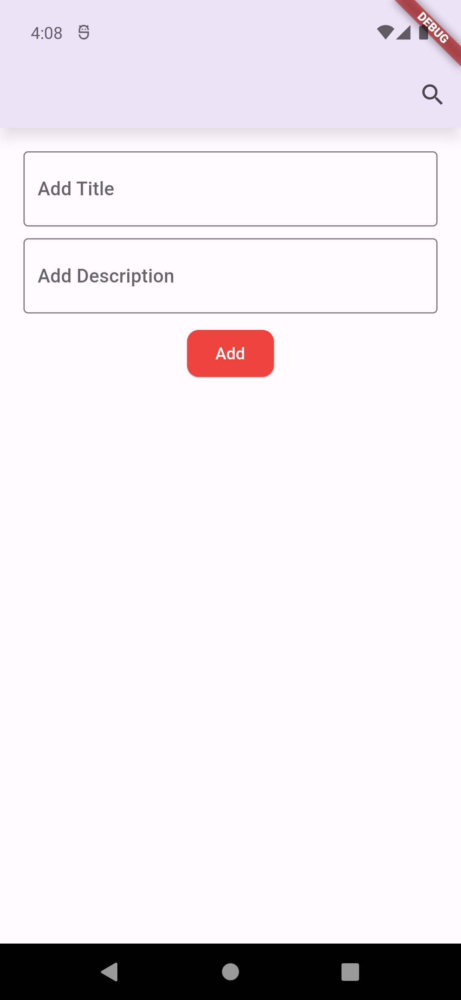
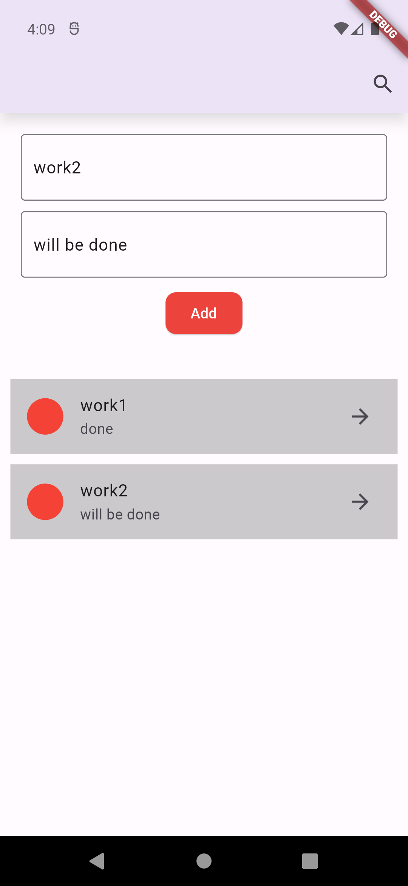
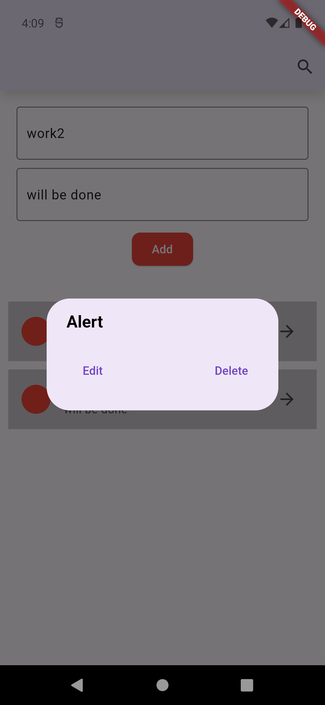
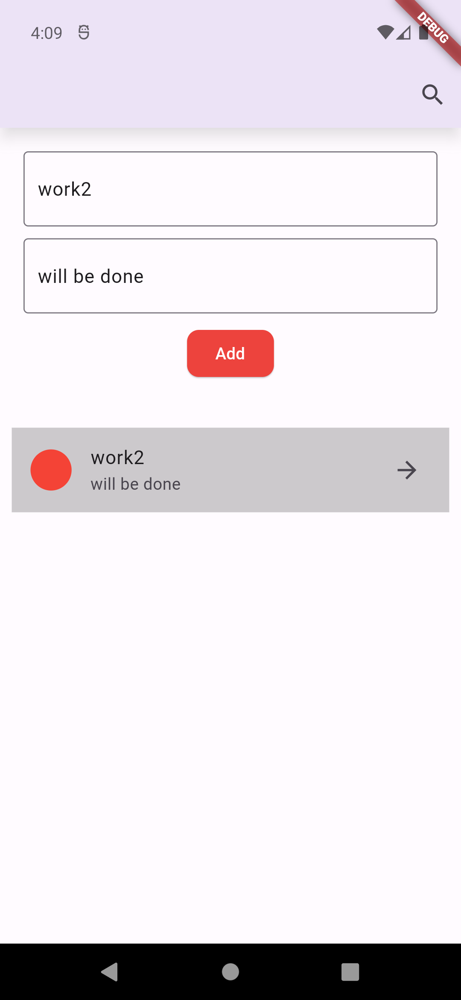
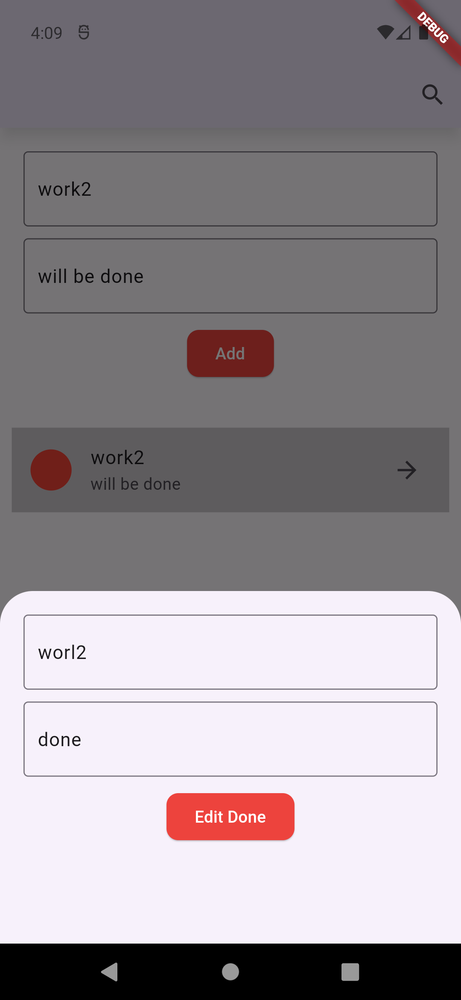

<h1 align="center" id="title">Assignment - 10: Task Manager</h1>

Screenshots are taken sequentially. If you start from top-left to right then you will get the sequence.

<h2>Project Screenshots:</h2>

     

<h2>🚀 Resume</h2>

[Tangim Haque - Portfolio](https://tangim.me)

<h2>🧐 Features</h2>

Here're some of the project's best features:

- Simple and most basic task manager using List and Map

<h2>💻 Built with</h2>

Technologies used in the project:

- Flutter
- API - github, youtube
<h2>💖Like my work?</h2>

Contact with me
<a href="https://www.youtube.com/watch?v=sMssfvnuQF0">Subscribe my Channel ❤ </a>

